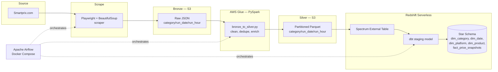

# PriceScope

An automated, orchestrated data pipeline that scrapes product prices from Smartprix.com twice daily, processes them through a medallion architecture on AWS, and lands them in a Redshift star schema for price-trend analysis.

## Overview

PriceScope tracks price movements for smartphones and laptops (and is built to extend to other categories) by scraping the same product catalog every 12 hours, tracing each snapshot through raw → cleaned → analytics-ready layers, and making it queryable in a dimensional model. The project was built end-to-end — scraper, orchestration, transformation, and infrastructure — as a hands-on data engineering exercise, including debugging a number of real production-style failures along the way (see [Challenges & Debugging Journey](#challenges--debugging-journey)).

## Architecture



**Bronze → Silver → Gold**, the medallion pattern:

- **Bronze**: raw scraped JSON, one file per scrape run, written as-is with no transformation
- **Silver**: typed, deduplicated, enriched Parquet — invalid records filtered, `product_id` generated via hash, discount/MRP fields normalized
- **Gold**: a dimensional model in Redshift (`dim_category`, `dim_date`, `dim_platform`, `dim_product`, `fact_price_snapshots`) queryable for price-trend analysis, including a `LAG()`-based `price_change` column comparing each snapshot to the previous one

## Tech Stack

| Layer | Tools |
|---|---|
| Scraping | Python, Playwright, BeautifulSoup |
| Storage | Amazon S3 (bronze + silver), partitioned by `category` / `run_date` / `run_hour` |
| Transformation | AWS Glue (PySpark), Glue 5.1, G.1X workers |
| Query federation | Redshift Spectrum (external schema over S3 Parquet) |
| Warehouse & modeling | Redshift Serverless, dbt-redshift |
| Orchestration | Apache Airflow 2.10.3, self-hosted via Docker Compose (webserver, scheduler, worker, triggerer, Postgres, Redis) |
| Alerting | Airflow's built-in `email_on_failure` via Gmail SMTP |

## Orchestration & Scheduling

A single Airflow DAG (`pricescope_pipeline`) runs four tasks in sequence:

```
scrape_smartprix → bronze_to_silver → dbt_run → dbt_test
```

- **Schedule**: `0 6,18 * * *` (UTC) — twice daily
- **`catchup=False`** — a paused/offline DAG doesn't backfill every missed slot on restart; it just waits for the next real interval
- Every task derives its `run_date`/`run_hour` from **`data_interval_end`**, which equals true wall-clock firing time for a genuinely scheduled run. Each task also supports an override via `dag_run.conf`, so a specific historical date/hour can be re-processed on demand without touching the DAG code:
  ```
  airflow dags trigger pricescope_pipeline -c '{"run_date": "2026-08-04", "run_hour": "06"}'
  ```

## Design Decisions & Tradeoffs

- **Idempotent writes**: the Glue job deletes any existing S3 objects under the exact `category/run_date/run_hour` prefix before writing, so re-running the same logical slot never produces duplicates — while still preserving every distinct hour's data as its own partition.
- **Isolated dbt environment**: dbt-redshift lives in its own virtualenv (`/opt/dbt_venv`) inside the Airflow image rather than alongside Airflow's own pinned dependencies, avoiding pip resolver conflicts between the two.
- **`fact_price_snapshots` is full-refresh (`materialized='table'`)**, not incremental. At the current data volume (tens of thousands of rows), a full `CREATE TABLE AS SELECT` rebuild costs a few seconds on Redshift Serverless — negligible. This was a deliberate choice for simplicity rather than a shortcut; it's flagged in [Known Limitations](#known-limitations) as the first thing to revisit if the dataset grows into the millions of rows.
- **Failure alerting** via Airflow's native `email_on_failure`/Gmail SMTP App Password rather than a third-party service, since it required no new infrastructure and covers the actual need (get notified when a task fails).

## Challenges & Debugging Journey

Building this surfaced several real, non-obvious bugs — the kind that don't show up until a pipeline runs unattended on a schedule. Documented here because diagnosing and fixing them was most of the actual engineering work.

| Problem | Root Cause | Fix |
|---|---|---|
| Duplicate bronze files from a single scheduled run | Airflow's zombie-task detection killed a slow scrape task before it could send a heartbeat, then automatically retried it — while the original process was still finishing its S3 write in the background | Diagnosed via try-1 vs try-2 logs; addressed by tuning heartbeat/zombie thresholds |
| `dbt run` failing with "No such file or directory" | A missing leading `/` in the dbt binary path inside a templated `bash_command` string | Corrected the path string |
| dbt test throwing a SQL syntax error | A trailing `;` in a test `.sql` file broke dbt's internal query-wrapping, since dbt runs each file inside its own `SELECT * FROM (...)` wrapper | Removed the semicolon — dbt SQL files should never be terminated with one |
| Silver layer silently losing history | The Glue job's delete-before-write step was keyed only on `category` + `run_date`, so a second same-day run (e.g. the 18:00 slot) deleted and overwrote that morning's 06:00 data before dbt ever read it | Added `run_hour` as a third partition key end-to-end: Glue's delete/write logic, the Spectrum external table DDL, and every downstream dbt model |
| Code changes not taking effect after re-uploading a fixed script | AWS Glue's **Script filename** field was pointed at a different file than the one actually being uploaded (an underscore/hyphen naming mismatch, with a stray Glue-auto-generated stub file adding to the confusion) | Traced via S3 object "last modified" timestamps vs. the job's configured script path; corrected the field and removed the stray files |
| Two tasks disagreeing on "what hour is it" | The scrape task computed its S3 partition from the scraper's own real-time clock, while the downstream Glue task derived its target hour from Airflow's templated logical date (`data_interval_start`) — these could point at different hours, especially around manual triggers and interval boundaries | Standardized every task on `data_interval_end` (the true firing time for scheduled runs), with a `dag_run.conf` override for manual testing |
| A Glue run reporting `FAILED` despite correct driver logic | A defensive "skip processing if no bronze data exists" check used a malformed S3 prefix (so it never actually matched real data) and called `sys.exit(0)` immediately — which could race Spark's executor bootstrap and crash the run | Fixed the prefix logic and restructured the script into a single `if/else` with one `job.commit()` at the true end, removing the early exit |
| Cryptic Python 2 `SyntaxError` when running `aws configure` | An unrelated PyPI package literally named `aws` had been installed into the project's virtualenv, shadowing the real AWS CLI's `aws` command | Removed the imposter package, reinstalled the correct `awscli` package |

## Project Structure

```
PriceScope/
├── airflow/
│   ├── dags/
│   │   └── pricescope_pipeline.py
│   ├── dbt_project/
│   │   ├── models/
│   │   │   ├── staging/
│   │   │   │   └── stg_smartprix_prices.sql
│   │   │   └── marts/
│   │   │       ├── dim_category.sql
│   │   │       ├── dim_date.sql
│   │   │       ├── dim_platform.sql
│   │   │       ├── dim_product.sql
│   │   │       └── fact_price_snapshots.sql
│   │   └── tests/
│   ├── glue_jobs/
│   │   └── bronze_to_silver.py
│   ├── Dockerfile
│   └── docker-compose.yaml
├── scrapers/
│   └── smartprix/
│       └── smartprix_scraper.py
└── scripts/
    └── upload_job_script_to_s3.py
```

## Getting Started

Requires an AWS account (S3, Glue, Redshift Serverless) and Docker Desktop.

1. Clone the repo and set up `.env` with AWS credentials, S3 bucket name, and Gmail SMTP App Password (see [Security & Sign-in → App passwords](https://myaccount.google.com/apppasswords))
2. Build and start the Airflow stack:
   ```
   cd airflow
   docker compose up -d
   ```
3. Upload the Glue job script:
   ```
   python scripts/upload_job_script_to_s3.py
   ```
4. Provision the Glue job, Redshift Serverless workgroup, and Spectrum external schema (see `bronze_to_silver.py`'s `register_partitions()` and the Spectrum DDL for expected table structure)
5. Unpause `pricescope_pipeline` in the Airflow UI (`localhost:8081`)

## Known Limitations

- `fact_price_snapshots` fully rebuilds on every dbt run rather than processing incrementally — fine at current volume, worth revisiting at much larger scale
- Runs on locally-hosted Docker Compose rather than an always-on server, so scheduling depends on the host machine staying awake — not production-grade uptime
- Single data source (Smartprix); no cross-platform price comparison yet
- No visualization layer yet — data is queryable in Redshift but not yet presented in a dashboard

## Future Improvements

- Convert `fact_price_snapshots` to incremental materialization if data volume grows substantially
- Deploy Airflow to an always-on host (e.g. a small EC2 instance or MWAA) for genuine continuous scheduling
- Add a lightweight price-trend dashboard
- Extend scraping to additional categories and sources
- CI/CD for dbt model testing and Glue script deployment

## Author

Built by Govind Tiwari.
